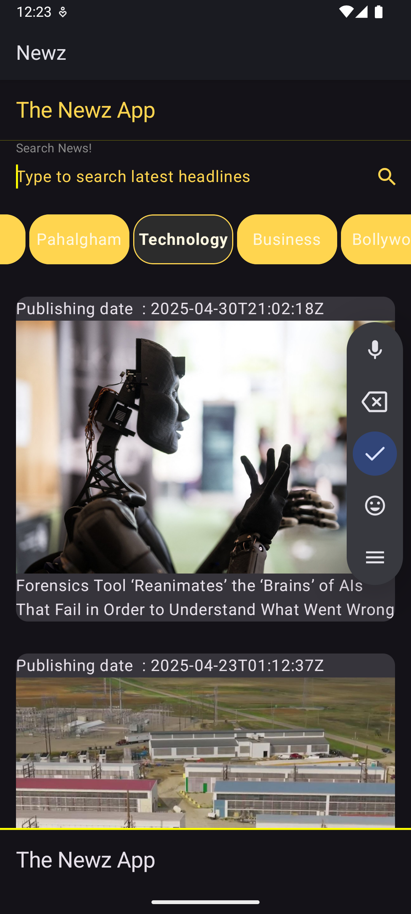
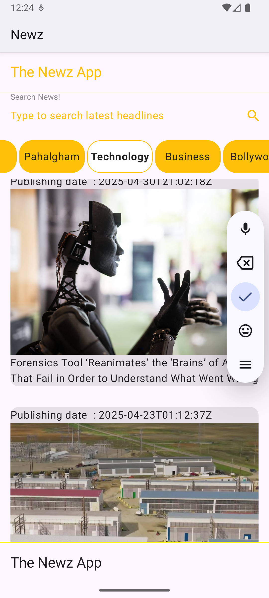

<p align="center">
  
  
  
</p>

<h1 align="center">🗞️ It's Newz - The News App</h1>

### 📌 Screenshots

In Dark mode theme:

<p align="center">
  
</p>

In Light mode theme:


<p align="center">
  
</p>


---

### 📲 Overview

**Newz** is a simple, modern news app built using **Jetpack Compose** and **Kotlin**, following a clean **MVVM Architecture**. It supports **Dark Mode** and pulls real-time news using the **NewsAPI**.

---

### 🚧 Features

✅ Clean MVVM Architecture  
✅ Built with Jetpack Compose  
✅ Dark Mode Support  
✅ Live news fetched using Retrofit  
✅ Uses Coil for image loading  
✅ Navigation between screens  
✅ Modern UI Design

---

### 🌐 Try It Yourself

🔗 **NewsAPI**: [https://newsapi.org](https://newsapi.org)

---

### 📦 Key Dependencies

```kotlin
// 🧭 Jetpack Navigation
implementation("androidx.navigation:navigation-compose:2.8.9")

// 🔄 Kotlinx Serialization
implementation("org.jetbrains.kotlinx:kotlinx-serialization-json:1.8.0")

// 🌐 Retrofit for API calls
implementation("com.squareup.retrofit2:retrofit:2.11.0")

// 🔁 Gson converter for Retrofit
implementation("com.squareup.retrofit2:converter-gson:2.11.0")

// ⚙️ OkHttp for HTTP requests
implementation("com.squareup.okhttp3:okhttp:4.10.0")

// 🖼️ Coil for loading images
implementation("io.coil-kt.coil3:coil-compose:3.1.0")
implementation("io.coil-kt.coil3:coil-network-okhttp:3.1.0")
```
Note: "Please verify all the dependencies and plugins to ensure successful built of an app, kindly verify them from build.gradle.kts file"

### 🙌 Built With

- Kotlin
- Jetpack Compose
- MVVM Architecture
- NewsAPI
- Retrofit & Coil
- Android Studio

---

> 🧑‍💻 _Made with ❤️ by Sachin Sharma_

